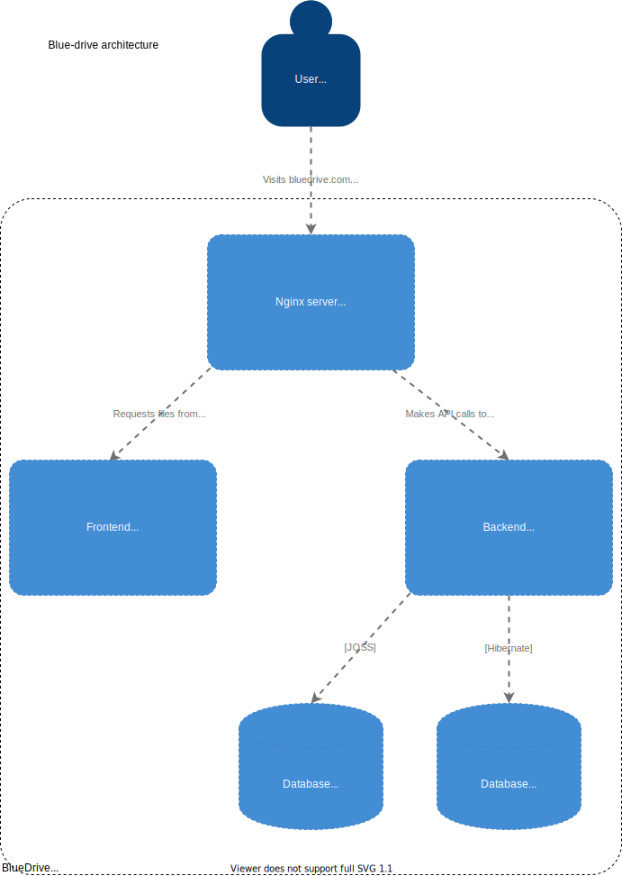
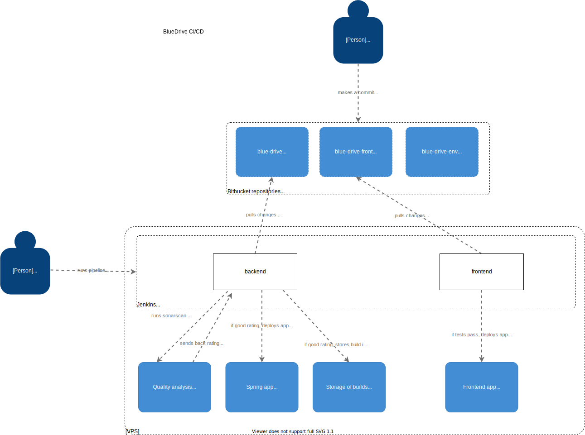

# BlueDrive

## Used ports

* 9000 - SonarQube
* 8100 - Nginx, app gateway
* 8097 - MongoDB
* 8096 - OpenStack Swift
* 8095 - Backend (and Swagger)
* 8090 - Frontend
* 8082 - Jenkins
* 8081 - Nexus

## Architecture 


## CI/CD


## Start CI/CD containers

In order to start *Jenkins*, *SonarQube* and *Nexus* containers simply run:

```
./CI/deploy.sh
```

## Deploy backend

Clone **blue-drive** repository and run following command from project's root directory:

```
./deploy.sh
```

This script will build application JAR and setup Docker container with appropriate environment variables containing services configuration exported. This process requires the user to set following environment variables values:

```
SPRING_DATA_MONGODB_HOST
SPRING_DATA_MONGODB_PASSWORD
SPRING_DATA_MONGODB_PORT
SPRING_DATA_MONGODB_USERNAME
SPRING_DATA_MONGODB_DATABASE
SWIFT_STORAGE_PWD
SWIFT_STORAGE_URL
SWIFT_STORAGE_USER
```


## Deploy frontend and Nginx
**Please refer to this [README.md](https://bitbucket.org/blueincorp/blue-drive-front/src/master/README.md)**