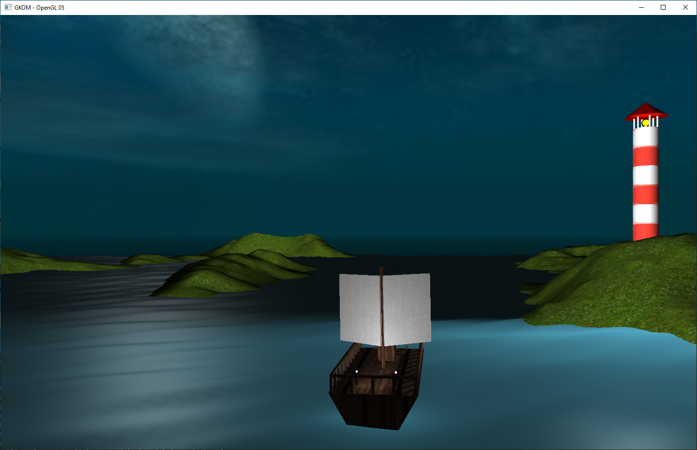

# Projekt Żaglowiec

## Uczestnicy
* Bartłomiej Janowski
* Damian Kolaska
* Magdalena Majkowska
* Maciej Wojno

## Temat projektu
Wyrenderowanie prostej sceny w OpenGL. Scena składałaby się z żaglowca na wodzie, fragmentów lądu oraz latarni.

# Rysunek prezentujący koncepcję


## Kamienie milowe - 
* Przygotowanie listy zadań ✅
* Wyświetlenie pierwszego sześcianu ✅
    * Oteksturowanie pierwszego sześcianu ✅
* Wyświetlenie złożonego obiektu z wykorzystaniem własnych metod ✅
* Zamodelowanie żaglowca ✅
	* Zamodelowanie otoczenia ✅
	* Oteksturowanie żaglowca ✅
    * Realizacja modeli we własnych metodach ✅
* Ruch obiektów (koło sterowe) ✅
* Implementacja oświetlenia ✅
    * Światło księżyca ✅
    * Światła w ramach sceny ✅
* Wyświetlanie wody ✅
* Ruch kamerą w scenie ✅
* Prezentacja

## Podział zadań
* Rendering prostych kształtów - Wszyscy, w celach zapoznawczych
* Interfejs złożonych obiektów - Damian Kolaska
* Generator kształtów podstawowych - Maciej Wojno
* Tekstury - Magdalena Majkowska
* Oświetlenie - Magdalena Majkowska
* Niebo (skybox) - Bartłomiej Janowski
* Woda - Maciej Wojno
* Kamera - Damian Kolaska
* Obsługa klawiatury i myszki - Damian Kolaska
* Opracowanie modelu latarni - Magdalena Majkowska
* Opracowanie modelu żaglowca - Damian Kolaska
* Koło sterowe (obracające się) - Damian Kolaska
* Height mapa - Damian Kolaska
* Shadow mapping - Bartłomiej Janowski
* Dźwięk - Magdalena Majkowska
* Sterowanie statkiem - Damian Kolaska

## Uruchomienie przykładowego programu gl_05


## Sterowanie
* WSAD + myszka - ruch kamery
* 0, 1 - kontrola czułości myszy
* 3, 4 - poziom oświetlenia
* F - wolna kamera
* G - kamera zablokowana na statku
#### Kiedy kamera zablokowana na statku
* WSAD - sterowanie statkiem
* scroll - kontrola dystansu kamery

## Obecny stan projektu


## Instalacja zależności
### Windows
Biblioteki linkowane statycznie
### Linux
Pakiety instalowane menedżerem pakietów *apt*
#### GLEW
```sh
sudo apt install libglew-dev
```
#### glm
```sh
sudo apt install libglm-dev
```
#### GLFW3
```sh
sudo apt install libglfw3-dev
```
#### SFML
```sh
sudo apt install libsfml-dev
```

## Jak wygenerować projekt
### Linux
```bash
mkdir build
cd build
cmake ..
```

### Windows

#### Visual Studio
##### Visual Studio Solution
Obie komendy wygenerują plik rozwiązania .sln. Należy go otworzyć, zbudować i uruchomić projekt *zaglowiec*
###### 32bit
```sh
mkdir build
cd build
cmake .. -AWin32
```
###### 64bit
```sh
mkdir build
cd build
cmake .. -A x64
```

##### CMake w Visual Studio
Zaintaluj dodatek do Visual Studio
https://github.com/MicrosoftDocs/cpp-docs/blob/master/docs/linux/download-install-and-setup-the-linux-development-workload.md
Otwórz plik *CMakeLists.txt* klikając:
*File->Open->CMake*

#### CMake w terminalu
```sh
mkdir build
cd build
cmake ..
cmake --build .
```

## Styl kodowania
Stosujemy styl kodowania oparty na *Google C++ Style*
Wprowadzamy następujące modyfikacje
```c++
const int kBufferSize = 128; // Google
const int BUFFER_SIZE = 128; // nasz styl

enum class UrlTableError { // Google
  kOk = 0,
  kOutOfMemory,
  kMalformedInput,
};

enum class UrlTableError { // nasz styl
  OK = 0,
  OUT_OF_MEMORY,
  MALFORMED_INPUT,
};

class MyClass { // Google
 public:
  ...
  void FooBar();
};

class MyClass { // nasz styl
public: // specyfikator dostępu -4 spacje
    ...
    void fooBar(); // tabulacja ma 4 spacje
};
```
**Stosujemy szerokość linii na poziomie 100 znaków**
**Stosujemy rozszerzenia .hpp oraz .cpp, a plik nazywamy w formacie snake_case** <br>
**Stosujemy #pragma once zamiast include guardów**